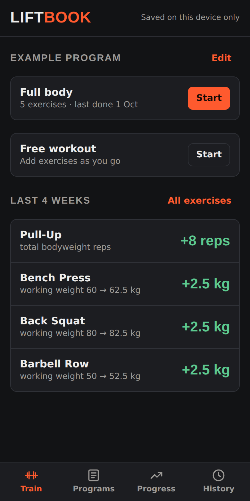
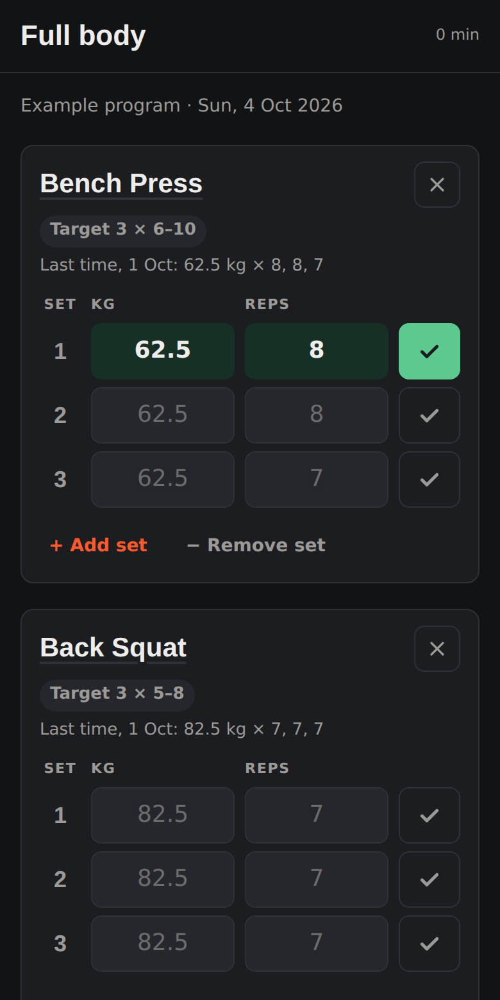
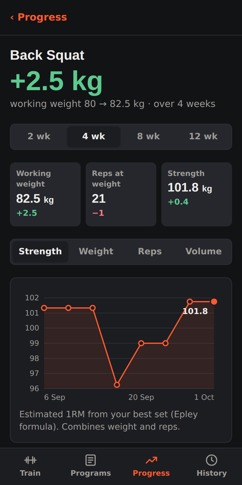
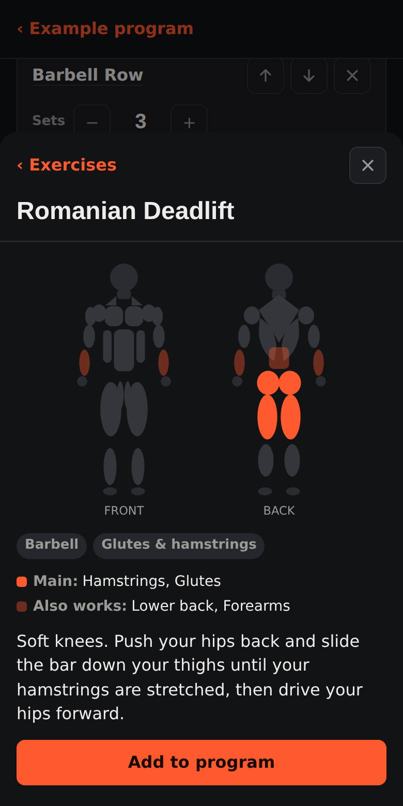

# Liftbook

A simple gym tracker for your phone. Build workout programs, log the weight and reps of every set, and see how each lift has progressed over the last few weeks.

<p>
  
  
  
  
</p>

## Features

- **Programs with several workouts.** A program holds one or more workout days, such as an upper/lower split with two upper-body and two lower-body days. Each day lists its exercises with a number of sets and a rep range, for example 3 × 8–12. The Train screen marks which workout is next in the rotation.
- **Templates.** Start a new program from Upper / Lower (4 days), Push / Pull / Legs (3 days), Full body (2 days) or an empty program, then change anything you like.
- **Exercise library.** Every exercise has a short how-to, the equipment it needs and a front/back muscle map showing the main and secondary muscles worked. Search by name or muscle and filter by equipment.
- **Workout logging.** Enter weight and reps set by set. The fields are pre-filled with what you did last time, so repeating a set is one tap on ✓.
- **Progression hints.** When every set reached the top of the rep range last time, the app suggests adding weight (+2.5 kg, or +1 kg on light lifts). This is the classic double-progression method.
- **Progress per exercise.** Pick a window of 2, 4, 8 or 12 weeks. If your working weight stayed the same, you see the change in reps ("+4 reps at the same weight, 60 kg"); if it went up, you see the change in kg. Each exercise has a chart of estimated 1RM, top weight, reps or volume, plus a table of past workouts.
- **History.** Every saved workout, newest first. Delete a workout with the bin button next to it; its sets are removed from your progress too.
- **Dark theme** in charcoal grey with a red-orange accent.
- **Works offline** and installs on the home screen like a regular app.
- **Example data.** "Try with example data" fills in six weeks of workouts so you can see how everything works, and "Remove examples" clears it again.

## Install on iPhone

The app needs to be served over HTTPS (see [Hosting](#hosting)). Then:

1. Open the app's address in **Safari**.
2. Tap the **Share** button (the square with an arrow pointing up).
3. Choose **Add to Home Screen** and tap **Add**.

Liftbook now opens full screen from its own icon and keeps working without a connection.

On Android, open the address in Chrome and choose **Install app** from the menu.

## Where your data is stored

Everything is stored in the browser's local storage on the device you use. Nothing is sent to a server, so workouts logged on your phone stay on your phone. If you delete the app from the home screen or clear Safari's website data, the workouts are deleted too.

## Hosting

The app is plain static files (`index.html`, `sw.js`, `manifest.webmanifest`, `icons/`), so any static host works.

**GitHub Pages**

1. In the repository go to **Settings → Pages**.
2. Under **Build and deployment**, choose **Deploy from a branch**, select `main` and `/ (root)`, and save.
3. After a minute the app is live at `https://<your-username>.github.io/liftbook/`.

GitHub Pages for a private repository needs a paid GitHub plan. On a free account, either make the repository public or use a free host such as Netlify or Cloudflare Pages and point it at this repository (no build command, publish directory `/`).

## Running it locally

There is no build step and no dependencies. Open the folder in VS Code and either:

- double-click `index.html` to open it in your browser, or
- serve the folder so offline mode and installing work too:

  ```sh
  python3 -m http.server 8000
  ```

  then open <http://localhost:8000>.

## Project structure

```
index.html              The whole app: markup, styles and JavaScript
sw.js                   Service worker that caches the app for offline use
manifest.webmanifest    App name, colours and icons for "Add to Home Screen"
icons/                  App icons (180 px for iOS, 192/512 px for Android)
docs/                   Screenshots used in this README
```

Inside `index.html` the script is split into sections:

- **Exercise library** (`LIB_SRC`): one line per exercise in the form `key|name|group|equipment|primary muscles|secondary muscles|description`. Add a line to add an exercise.
- **Program templates** (`TEMPLATES`): each workout day is a list of `exercise-key:sets:min reps:max reps`.
- **Muscle map** (`BODY`, `bodySvg`): the front and back figure drawn as SVG shapes, one group per muscle.
- **Storage**: saves to `localStorage`. When the page runs inside a Claude artifact it uses the artifact's database instead, so the same file also works as the Claude-hosted version.
- **Analytics** (`exHistory`, `compare`, `headline`, `suggestion`): turns logged sets into the progress numbers and weight suggestions.
- **Views** (`vTrain`, `vWorkout`, `vPrograms`, `vNewProgram`, `vEditProgram`, `vEditDay`, `vProgress`, `vExercise`, `vHistory`): each returns the HTML for one screen.

When you change `index.html`, bump `CACHE` in `sw.js` (for example `liftbook-v3`) so installed copies pick up the new version.
